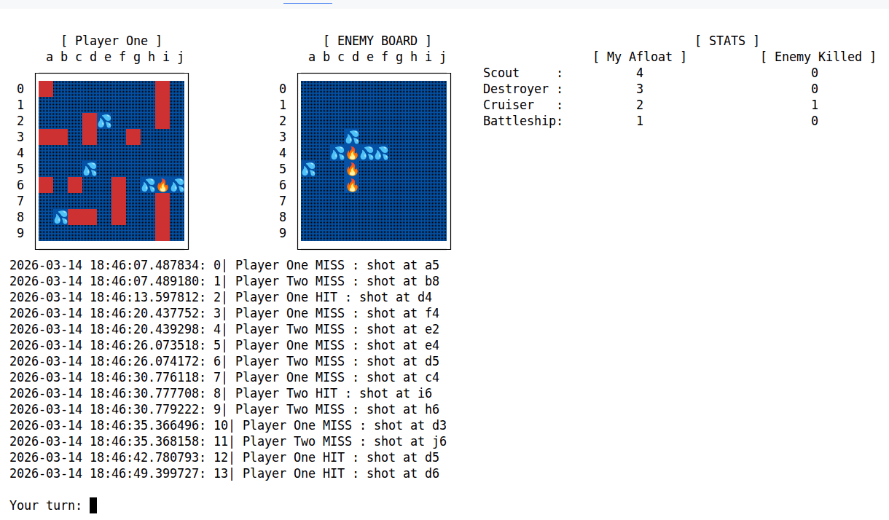
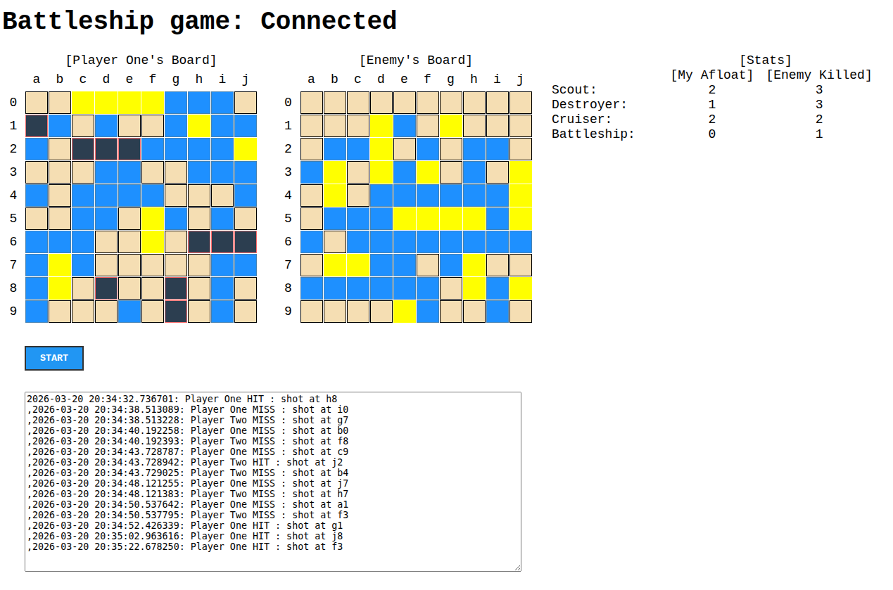

# 📖 Project Overview
AI was utilized as a technical assistant (via web interface) to streamline the development process.

## 🧑‍ My Responsibilities
* Architectural Design (System-level decisions)
* Design Patterns & Logic (Selection and implementation)
* Tech Stack Selection
* Core Development & Coding

## 🤖 AI Contributions (Assistant)
Consultation on:
* Technical Documentation
* Python Best Practices

Supplementary support:
* Unit Testing (Partial code generation)
* Algorithm Optimization (Review and recommendations)

### 🧠 Models Leveraged
* Google Gemini
* Qwen
* Deepseek

# 🛠️ Tech Stack
- Python 3.12+
- Architecture: OOP, SOLID principles, patterns (Vistor)
- Additional packages: numpy, 
- Testing: pytest
- Build: hatchling, uv
- Web: Vue 3, Typescript, Html/Css, socket.io, axios, FastApi, FastSession

# 🚢 About Game
Battleship is a classic two-player guessing game where players try to sink each other's fleet of ships. It's like a naval combat played on grid boards!

## Console UI

## Web Vue UI (v1)

# 🚀 Features
* 🤖 Smart AI Opponent – Uses hunt-and-target logic (no cheap cheats).
* 🎨 Clean ANSI Graphics – Crisp visuals directly in your terminal.
* 📊 Live Statistics – Track your ships afloat and enemy's ships killed.
* 🧪 Fully Tested – Built with pytest for reliable gameplay.
* 🏗️ Clean Architecture – Modular src/ layout, easy to extend.

# 🚀 How to Run
Get up and running in seconds:

1. Clone the repo
    git clone https://github.com/yourusername/battleship.git
    cd battleship

2. Install dependencies (uv handles everything)
    uv sync

3. Launch the game
    uv run python -m src
